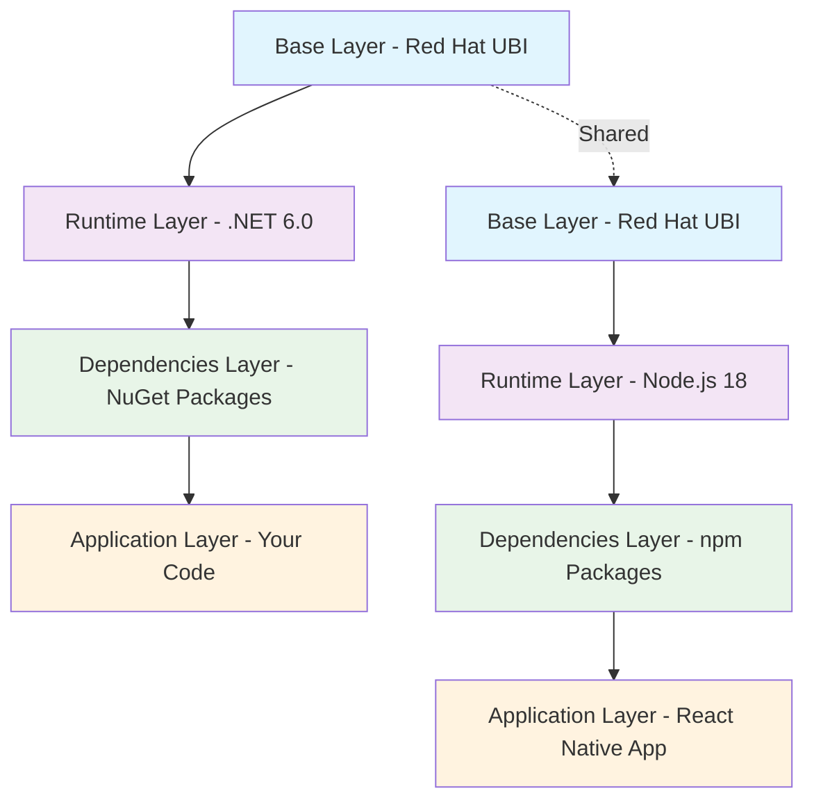

# Containers: Citizens of the Hybrid Cloud

## Background

Traditionally, software releases involved promoting application code and its configuration across separate environments. This often led to inconsistencies between development, testing, and production, resulting in failed deployments and the classic "it worked on my machine" problem.

Containers solve this issue by bundling the application with all its libraries and dependencies into a single, portable unit.  This guarantees that the application runs identically everywhere, from a developer's laptop to the production servers. By eliminating environmental drift, containers enable enterprises to release software more reliably, innovate faster, and scale with confidence.


## What is a Container?

Think of a container as a process like any other software, but with its own underlying operating system environment. Running an OS as a program on a host machine opens up several possibilities. For example, if a tool only works on Alma Linux or RHEL, we can use an appropriate container without impacting other processes running on the system. 

For application developers, they can now start visualization that their software too can run on the desired OS and the runtime tools they want without impacting the host machine or other processes. 

A typical container encapsulates everything needed to run the application—code, runtime, system tools, libraries, and configuration files—into a standardized package. As a result, containers guarantee reliable operation across different environments, from a developer’s laptop to production servers.

### Visualization

```text
┌─────────────────────────────────────┐
│           HOST OPERATING SYSTEM     │
├─────────────────────────────────────┤
│  Container Runtime (Podman/CRI-O)   │
├─────────────────────────────────────┤
│ ┌─────────┐ ┌─────────┐ ┌─────────┐ │
│ │Container│ │Container│ │Container│ │
│ │    A    │ │    B    │ │    C    │ │
│ │         │ │         │ │         │ │
│ │ App +   │ │ App +   │ │ App +   │ │
│ │ Libs    │ │ Libs    │ │ Libs    │ │
│ └─────────┘ └─────────┘ └─────────┘ │
└─────────────────────────────────────┘
```

### Container Process Isolation

A container operates as an isolated process on the host system with the following characteristics:

1. **Namespace Isolation**: Provides dedicated views of system resources including process IDs, network interfaces, and file systems
2. **File System Virtualization**: Each container maintains an independent file system view through layered images  
3. **Resource Management**: Control groups (cgroups) enforce resource limits for CPU, memory, and I/O operations
4. **Security Boundaries**: Multiple isolation mechanisms prevent interference between containers and the host system

This process-based approach enables containers to share the host OS kernel while maintaining application isolation and security.

## Container Images

A running application is typically called a process or service. In the world of containers, the definition for what a container will run comes from a container image. A container image acts as a blueprint: it contains all the code, dependencies, and configuration needed to create a running container. When executed, this image provides everything required for the containerized application to function consistently across environments.

### Images and Containers Relationship

Container technology distinguishes between two fundamental concepts:

- **Container Image**: A static, immutable template containing application code, runtime components, system tools, libraries, and configuration settings
- **Container**: A running instance of a container image executing as a process on the host system

This relationship follows a template-instance pattern where:

- **Image**: Serves as the immutable template defining the container's contents and configuration
- **Container**: Represents the runtime instantiation of the image as an active process

### Layered File System Architecture

Container images implement a layered file system architecture that provides operational and management benefits:

```text
┌─────────────────────────────────────┐
│         Application Layer           │  ← Application code
├─────────────────────────────────────┤
│       Dependencies Layer            │  ← Package dependencies  
├─────────────────────────────────────┤
│        Runtime Layer                │  ← Runtime environment
├─────────────────────────────────────┤
│       Base OS Layer                 │  ← Red Hat UBI
└─────────────────────────────────────┘
          Container Image
```

#### Layer Architecture Diagram



### Image Formats and Standards

#### Docker Format 

The **Docker container format** is the original and most widely recognized standard for packaging and distributing containerized applications. Developed by Docker, Inc., this format popularized the use of containers in modern software development. For many, the terms "container" and "Docker" have become nearly synonymous, reflecting Docker's dominant role in the early container ecosystem.

However, it's important to note that the Docker image format and runtime were initially closed source and tightly coupled to Docker's own tooling and platform. This proprietary approach led to concerns about vendor lock-in and interoperability, motivating the industry to develop open standards like the OCI (Open Container Initiative) format. RedHat encourges everyone to stick to open source standards.

#### OCI (Open Container Initiative) Standard

The container industry has adopted the OCI Image Format as the standard specification, ensuring compatibility across different container runtimes and platforms:

```json
{
  "schemaVersion": 2,
  "mediaType": "application/vnd.oci.image.manifest.v1+json",
  "config": {
    "mediaType": "application/vnd.oci.image.config.v1+json",
    "size": 1469,
    "digest": "sha256:83f19d5902f8b2d8..."
  },
  "layers": [
    {
      "mediaType": "application/vnd.oci.image.layer.v1.tar+gzip",
      "size": 73109,
      "digest": "sha256:b49b96bfa4aa2..."
    }
  ]
}
```
#### Base Images 

Container base images are the foundational layers upon which all containerized applications are built. Choosing a stable and secure base image from a trusted source is critical because vulnerabilities or misconfigurations in the base can compromise the entire application stack. Trusted sources, such as official or vendor-supported registries, provide regularly updated images with security patches and compliance guarantees, reducing the risk of introducing security flaws and ensuring consistent, reliable deployments across environments.

#### Red Hat Universal Base Images (UBI)

Red Hat Universal Base Images provide enterprise-grade container base images for production deployments:

```text
UBI Image Family:
├── ubi8/ubi              (Full base image)
├── ubi8/ubi-minimal      (Minimal base - 92MB)
├── ubi8/ubi-micro        (Ultra minimal - 37MB)
├── ubi8/dotnet-60        (.NET 6.0 runtime)
├── ubi8/nodejs-18        (Node.js 18 runtime)
└── ubi8/python-39        (Python 3.9 runtime)
```

**UBI Advantages:**

- **Enterprise Security**: Regular security updates and vulnerability patches
- **Compliance**: Adherence to enterprise security and compliance standards
- **Support**: Integration with Red Hat enterprise support services
- **Redistribution Rights**: Freely redistributable without licensing restrictions
- **CVE Management**: Proactive security vulnerability identification and remediation

## Container Repositories and Distribution

### Container Registries

Container registries serve as centralized repositories for storing and distributing container images. These registries support the software supply chain by providing:

- **Image Storage**: Centralized storage for container images with version control
- **Access Control**: Authentication and authorization mechanisms for image access
- **Distribution**: Efficient image distribution across different environments
- **Security Scanning**: Automated vulnerability assessment of stored images

### Red Hat Container Catalog

The Red Hat Container Catalog provides enterprise-grade container images with:

- **Certified Images**: Verified compatibility with Red Hat platforms
- **Security Updates**: Regular security patches and vulnerability fixes
- **Support Integration**: Enterprise support for containerized applications
- **Compliance Standards**: Adherence to enterprise security and compliance requirements

### Image Naming and Tagging

Container images follow standardized naming conventions for identification and versioning:

```text
registry.access.redhat.com/ubi8/dotnet-60:latest
├─────────────────────────┤ ├───┤ ├────────┤ ├────┤
│                         │ │   │ │        │ │    │
│      Registry Host      │ │    Namespace │ │ Tag│
│                         │ │   │ │  Image │ │    │
└─────────────────────────┘ └───┘ └────────┘ └────┘
```

**Naming Components:**
- **Registry**: Container registry hostname (registry.access.redhat.com)
- **Namespace**: Organizational or project grouping (ubi8)
- **Repository**: Specific image name (dotnet-60)
- **Tag**: Version or variant identifier (latest, v1.0, dev)

## Container Image Examples

### Example 1: .NET Application Container Image

This example demonstrates the layered structure of a .NET application container image:

```containerfile
# Base layer: Red Hat UBI .NET runtime
FROM registry.access.redhat.com/ubi8/dotnet-60-runtime

# Application configuration layer
WORKDIR /app
EXPOSE 5000
ENV ASPNETCORE_URLS=http://+:5000
ENV ASPNETCORE_ENVIRONMENT=Production

# Security layer: Non-root user creation
RUN groupadd -r appuser && useradd -r -g appuser appuser

# Application layer: Copy application files
COPY --chown=appuser:appuser bin/Release/net6.0/publish/ .
USER appuser

# Runtime configuration
ENTRYPOINT ["dotnet", "MyApi.dll"]
```

**Layer Breakdown:**
- **Base Layer**: UBI .NET runtime environment (shared across .NET applications)
- **Configuration Layer**: Environment variables and port configuration
- **Security Layer**: User account and permission setup
- **Application Layer**: Application-specific code and dependencies

### Example 2: Multi-Stage Build Pattern

Multi-stage builds optimize image size by separating build and runtime environments:

```containerfile
# Build stage
FROM registry.access.redhat.com/ubi8/dotnet-60 AS build
WORKDIR /src
COPY *.csproj .
RUN dotnet restore
COPY . .
RUN dotnet publish -c Release -o /app/publish

# Runtime stage
FROM registry.access.redhat.com/ubi8/dotnet-60-runtime AS runtime
WORKDIR /app
COPY --from=build /app/publish .
RUN groupadd -r appuser && useradd -r -g appuser appuser
RUN chown -R appuser:appuser /app
USER appuser
ENTRYPOINT ["dotnet", "MyApi.dll"]
```

**Benefits:**
- **Reduced Size**: Final image contains only runtime dependencies
- **Security**: Build tools excluded from production image
- **Performance**: Faster container startup and network transfer

## Container Design Considerations

### Image Size Optimization

Container image size impacts performance, security, and resource utilization:

**Optimization Strategies:**

1. **Minimal Base Images**: Use purpose-built minimal images (ubi-minimal, ubi-micro)
2. **Multi-Stage Builds**: Separate build and runtime environments
3. **Layer Consolidation**: Combine related operations in single RUN instructions
4. **Dependency Management**: Include only required runtime dependencies

**Image Size Comparison:**

```text
Image Type                Size        Use Case
ubi8/ubi                 214MB       Full development environment
ubi8/ubi-minimal          92MB       Production applications
ubi8/ubi-micro            37MB       Microservices and minimal applications
```

### Security Considerations

Container security requires attention to multiple layers:

**Security Principles:**

1. **Least Privilege**: Run applications with minimal required permissions
2. **Non-Root Users**: Avoid running processes as root within containers
3. **Minimal Attack Surface**: Include only necessary components and dependencies
4. **Regular Updates**: Maintain current base images with security patches

**Security Implementation Example:**

```containerfile
FROM registry.access.redhat.com/ubi8/ubi-minimal

# Create dedicated application user
RUN microdnf install shadow-utils && \
    groupadd -r appuser && \
    useradd -r -g appuser appuser && \
    microdnf clean all

WORKDIR /app
COPY --chown=appuser:appuser application /app/
USER appuser

ENTRYPOINT ["./application"]
```

## Best Practices

### Security Best Practices

1. **Use Rootless Containers**: Run Podman without root privileges
2. **Non-root User**: Always run applications as non-root users inside containers
3. **Minimal Base Images**: Use UBI minimal images when possible
4. **Regular Updates**: Keep base images updated with security patches
5. **Secrets Management**: Never include secrets in images

```containerfile
# Example of secure container setup
FROM registry.access.redhat.com/ubi8/dotnet-60-runtime

# Create non-root user
RUN groupadd -r appuser && useradd -r -g appuser appuser

WORKDIR /app
COPY --chown=appuser:appuser . .

# Switch to non-root user
USER appuser

ENTRYPOINT ["dotnet", "MyApp.dll"]
```

### Performance Best Practices

1. **Layer Caching**: Order containerfile instructions to maximize cache hits
2. **Multi-stage Builds**: Separate build and runtime environments
3. **Minimize Layers**: Combine RUN commands when logical
4. **.containerignore**: Exclude unnecessary files from build context

Example `.containerignore`:
```
node_modules
.git
*.md
.gitignore
containerfile*
*.log
```

### Development Workflow

1. **Local Development**: Use volume mounts for hot reloading
2. **Testing**: Create separate images for testing environments
3. **Debugging**: Use interactive shells for troubleshooting

```bash
# Interactive debugging session
podman run -it --rm myimage /bin/bash

# Run with development volume mounts
podman run -d \
  -v $(pwd):/app:Z \
  -p 5000:5000 \
  --name dev-container \
  myapi:dev
```

## Tools and Resources

### Essential Podman Commands

```bash
# Image management
podman images                    # List images
podman pull image:tag           # Pull image
podman rmi image:tag            # Remove image
podman build -t name:tag .      # Build image

# Container management
podman ps                       # List running containers
podman ps -a                    # List all containers
podman run [options] image      # Run container
podman stop container           # Stop container
podman rm container             # Remove container

# Networking
podman network ls               # List networks
podman network create name      # Create network
podman port container           # Show port mappings

# Troubleshooting
podman logs container           # View logs
podman exec -it container bash  # Interactive shell
podman inspect container        # Detailed information
```

### Useful Resources

- [Podman Official Documentation](https://docs.podman.io/)
- [Red Hat UBI Images](https://access.redhat.com/containers/)
- [Container Best Practices](https://developers.redhat.com/blog/2018/02/22/container-terminology-practical-introduction/)
- [Rootless Containers Guide](https://github.com/containers/podman/blob/main/docs/tutorials/rootless_tutorial.md)

## Hands-on Exercise

### Exercise: Containerize a Full-Stack Application

Create a multi-container application with:
1. .NET Web API backend
2. React frontend
3. PostgreSQL database

**Requirements**:
- Use only Red Hat UBI base images
- Implement proper security practices (non-root users)
- Use Podman networks for container communication
- Include proper error handling and logging
- Create a podman compose  file for orchestration

**Steps**:

1. Create the .NET API with Entity Framework
2. Create a React frontend that consumes the API
3. Set up PostgreSQL with proper initialization
4. Create containerfiles for each component
5. Create a `compose.yml` file
6. Test the complete application stack

**Deliverables**:
- Working containerized application
- Documentation of the containerization process
- Security analysis of the implementation
- Performance testing results

## Summary

Container fundamentals with Podman provide the foundation for modern application development and deployment. Key takeaways include:

- **Podman offers enhanced security** through rootless containers and daemonless architecture
- **Red Hat UBI images** provide enterprise-grade security and compliance
- **Proper security practices** include non-root users and minimal base images
- **Multi-stage builds** optimize image size and security
- **Container orchestration** enables complex application architectures
- **Development workflows** benefit from containerization through consistency and portability

By mastering these container fundamentals, developers can build secure, scalable, and maintainable applications that follow modern DevOps practices and integrate seamlessly with cloud-native architectures.

