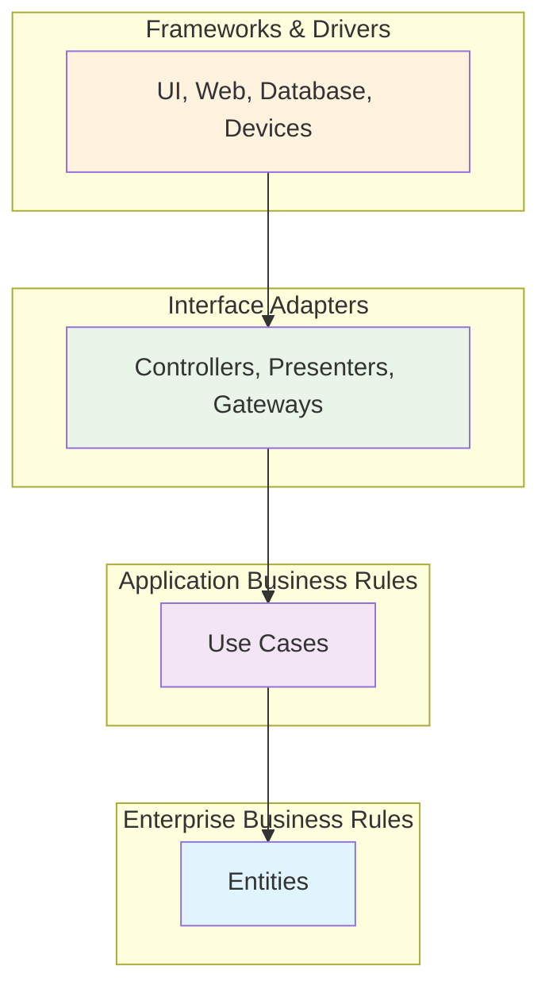

# Clean Architecture: Building Maintainable and Adaptable Software

## Overview

Clean Architecture represents a software design approach that prioritizes long-term maintainability, testability, and adaptability through systematic separation of concerns. This architectural pattern organizes code into distinct layers with clearly defined responsibilities and boundaries, enabling development teams to build applications that remain flexible and maintainable as requirements evolve.

The architecture's principles support modern development practices by isolating business logic from framework dependencies, database implementations, and user interface concerns. This separation enables teams to make technology decisions independently while preserving the core business value embedded in application logic.

## Architecture Principles

### Separation of Concerns

Clean Architecture implements strict separation between different aspects of application functionality:

- **Business Logic Isolation**: Core business rules remain independent of external frameworks and technologies
- **Infrastructure Independence**: Database, web frameworks, and external services operate as replaceable components
- **User Interface Decoupling**: Presentation logic separates from business logic, enabling multiple interface implementations
- **Cross-Cutting Concerns**: Logging, security, and monitoring integrate without affecting core business operations

### Testability Benefits

The architectural approach provides significant advantages for testing practices:

- **Unit Testing**: Business logic testing occurs without database or external service dependencies
- **Integration Testing**: Interface boundaries enable focused testing of component interactions
- **Test Isolation**: Individual layers undergo testing independently, reducing test complexity
- **Mock Implementation**: External dependencies utilize mock implementations during testing phases

### Technology Flexibility

Clean Architecture enables technology stack evolution without business logic modifications:

- **Framework Independence**: Application core remains unaffected by web framework changes
- **Database Agnosticism**: Data persistence implementations can change without business logic impact
- **External Service Integration**: Third-party service integrations operate through well-defined interfaces
- **Deployment Environment Adaptation**: Applications deploy across different environments with configuration changes only

## Architecture Layers

### Dependency Rule

The fundamental principle governing Clean Architecture states that source code dependencies must point inward toward higher-level policies. This rule ensures that:

- Inner layers remain unaware of outer layer implementations
- Business logic maintains independence from framework choices
- Core functionality operates without external system dependencies
- Changes in outer layers do not affect inner layer stability

### Layer Structure

Clean Architecture organizes code into four concentric layers, each with distinct responsibilities:

#### Entities (Enterprise Business Rules)

The innermost layer contains enterprise-wide business rules and domain models:

- **Domain Objects**: Core business entities representing fundamental business concepts
- **Business Rules**: Enterprise-wide policies and constraints that transcend individual applications
- **Value Objects**: Immutable objects that describe domain characteristics
- **Domain Services**: Operations that don't naturally belong to specific entities

#### Use Cases (Application Business Rules)

The application layer orchestrates business logic for specific use cases:

- **Application Services**: Coordinate domain objects to fulfill business use cases
- **Command Handlers**: Process commands that modify application state
- **Query Handlers**: Execute queries to retrieve application data
- **Business Workflows**: Implement complex business processes involving multiple domain objects

#### Interface Adapters

The interface layer converts data between use cases and external systems:

- **Controllers**: Handle HTTP requests and coordinate with application services
- **Presenters**: Format data for specific user interface requirements
- **Repository Interfaces**: Define contracts for data persistence operations
- **Gateway Interfaces**: Abstract external service integrations

#### Frameworks and Drivers

The outermost layer contains implementation details and external interfaces:

- **Web Frameworks**: ASP.NET Core controllers and middleware
- **Database Systems**: Entity Framework implementations and data access
- **External APIs**: Third-party service integrations and client libraries
- **User Interfaces**: React Native components and mobile platform interfaces

### Dependency Inversion

Clean Architecture implements dependency inversion through interface definitions:

- **Interface Definition**: Inner layers define contracts for required external services
- **Implementation Injection**: Outer layers provide concrete implementations of defined interfaces
- **Runtime Binding**: Dependency injection containers resolve interface implementations at runtime
- **Testing Support**: Mock implementations facilitate isolated testing of business logic

## Clean Architecture Visual Model

The following diagram illustrates the four layers of Clean Architecture and demonstrates how the Dependency Rule enforces inward-pointing dependencies:



## Prerequisites

### Development Environment

- Understanding of object-oriented programming principles
- Familiarity with dependency injection concepts
- Experience with .NET Core or React Native development
- Knowledge of containerization using Podman
- Access to Red Hat Universal Base Images

### Technical Requirements

- .NET 6.0+ SDK for backend development
- Node.js 18+ for React Native development
- Podman installed and configured
- Visual Studio Code or similar development environment
- Understanding of unit testing frameworks (xUnit, Jest)

## Practical Examples

### Example 1: .NET Web API with Clean Architecture

This example demonstrates implementing Clean Architecture in a .NET Web API application for order management.

#### Domain Layer (Entities)

```csharp
// Domain/Entities/Order.cs
namespace OrderManagement.Domain.Entities
{
    public class Order
    {
        public Guid Id { get; private set; }
        public string CustomerName { get; private set; }
        public DateTime OrderDate { get; private set; }
        public decimal TotalAmount { get; private set; }
        public OrderStatus Status { get; private set; }
        private readonly List<OrderItem> _items = new();
        public IReadOnlyList<OrderItem> Items => _items.AsReadOnly();

        private Order() { } // Required for EF Core

        public Order(string customerName)
        {
            Id = Guid.NewGuid();
            CustomerName = customerName ?? throw new ArgumentNullException(nameof(customerName));
            OrderDate = DateTime.UtcNow;
            Status = OrderStatus.Pending;
            TotalAmount = 0;
        }

        public void AddItem(string productName, decimal price, int quantity)
        {
            if (Status != OrderStatus.Pending)
                throw new InvalidOperationException("Cannot modify confirmed order");

            var item = new OrderItem(productName, price, quantity);
            _items.Add(item);
            RecalculateTotal();
        }

        public void ConfirmOrder()
        {
            if (!_items.Any())
                throw new InvalidOperationException("Cannot confirm empty order");

            Status = OrderStatus.Confirmed;
        }

        private void RecalculateTotal()
        {
            TotalAmount = _items.Sum(item => item.TotalPrice);
        }
    }

    public enum OrderStatus
    {
        Pending,
        Confirmed,
        Shipped,
        Delivered
    }
}
```

#### Application Layer (Use Cases)

```csharp
// Application/UseCases/CreateOrderUseCase.cs
namespace OrderManagement.Application.UseCases
{
    public interface ICreateOrderUseCase
    {
        Task<CreateOrderResponse> ExecuteAsync(CreateOrderRequest request);
    }

    public class CreateOrderUseCase : ICreateOrderUseCase
    {
        private readonly IOrderRepository _orderRepository;
        private readonly ILogger<CreateOrderUseCase> _logger;

        public CreateOrderUseCase(IOrderRepository orderRepository, ILogger<CreateOrderUseCase> logger)
        {
            _orderRepository = orderRepository ?? throw new ArgumentNullException(nameof(orderRepository));
            _logger = logger ?? throw new ArgumentNullException(nameof(logger));
        }

        public async Task<CreateOrderResponse> ExecuteAsync(CreateOrderRequest request)
        {
            try
            {
                var order = new Order(request.CustomerName);
                
                foreach (var item in request.Items)
                {
                    order.AddItem(item.ProductName, item.Price, item.Quantity);
                }

                await _orderRepository.SaveAsync(order);
                
                _logger.LogInformation("Order created successfully: {OrderId}", order.Id);
                
                return new CreateOrderResponse
                {
                    OrderId = order.Id,
                    TotalAmount = order.TotalAmount,
                    Status = order.Status.ToString()
                };
            }
            catch (Exception ex)
            {
                _logger.LogError(ex, "Failed to create order for customer: {CustomerName}", request.CustomerName);
                throw;
            }
        }
    }
}
```

#### Interface Adapters (Controllers)

```csharp
// Infrastructure/Web/Controllers/OrdersController.cs
namespace OrderManagement.Infrastructure.Web.Controllers
{
    [ApiController]
    [Route("api/[controller]")]
    public class OrdersController : ControllerBase
    {
        private readonly ICreateOrderUseCase _createOrderUseCase;
        private readonly ILogger<OrdersController> _logger;

        public OrdersController(ICreateOrderUseCase createOrderUseCase, ILogger<OrdersController> logger)
        {
            _createOrderUseCase = createOrderUseCase ?? throw new ArgumentNullException(nameof(createOrderUseCase));
            _logger = logger ?? throw new ArgumentNullException(nameof(logger));
        }

        [HttpPost]
        public async Task<ActionResult<CreateOrderResponse>> CreateOrder([FromBody] CreateOrderRequest request)
        {
            if (!ModelState.IsValid)
            {
                return BadRequest(ModelState);
            }

            try
            {
                var response = await _createOrderUseCase.ExecuteAsync(request);
                return CreatedAtAction(nameof(GetOrder), new { id = response.OrderId }, response);
            }
            catch (ArgumentException ex)
            {
                _logger.LogWarning(ex, "Invalid order creation request");
                return BadRequest(ex.Message);
            }
            catch (Exception ex)
            {
                _logger.LogError(ex, "Unexpected error creating order");
                return StatusCode(500, "An error occurred while processing the request");
            }
        }

        [HttpGet("{id}")]
        public async Task<ActionResult<OrderDto>> GetOrder(Guid id)
        {
            // Implementation for retrieving orders
            return NotFound();
        }
    }
}
```

#### Container Configuration

```Containerfile
FROM registry.access.redhat.com/ubi8/dotnet-60 AS build
WORKDIR /src

# Copy project files and restore dependencies
COPY ["OrderManagement.Api/OrderManagement.Api.csproj", "OrderManagement.Api/"]
COPY ["OrderManagement.Application/OrderManagement.Application.csproj", "OrderManagement.Application/"]
COPY ["OrderManagement.Domain/OrderManagement.Domain.csproj", "OrderManagement.Domain/"]
COPY ["OrderManagement.Infrastructure/OrderManagement.Infrastructure.csproj", "OrderManagement.Infrastructure/"]

RUN dotnet restore "OrderManagement.Api/OrderManagement.Api.csproj"

# Copy source code and build
COPY . .
WORKDIR "/src/OrderManagement.Api"
RUN dotnet build -c Release -o /app/build

FROM build AS publish
RUN dotnet publish -c Release -o /app/publish

# Create runtime image
FROM registry.access.redhat.com/ubi8/dotnet-60-runtime AS runtime
WORKDIR /app

# Create non-root user for security
RUN groupadd -r appuser && useradd -r -g appuser appuser
COPY --from=publish --chown=appuser:appuser /app/publish .
USER appuser

EXPOSE 5000
ENV ASPNETCORE_URLS=http://+:5000
ENTRYPOINT ["dotnet", "OrderManagement.Api.dll"]
```

### Example 2: React Native Mobile App with Clean Architecture

This example demonstrates implementing Clean Architecture in a React Native application for the same order management system.

#### Domain Entities (TypeScript)

```typescript
// src/domain/entities/Order.ts
export interface OrderItem {
  productName: string;
  price: number;
  quantity: number;
  totalPrice: number;
}

export enum OrderStatus {
  PENDING = 'pending',
  CONFIRMED = 'confirmed',
  SHIPPED = 'shipped',
  DELIVERED = 'delivered'
}

export class Order {
  constructor(
    public readonly id: string,
    public readonly customerName: string,
    public readonly orderDate: Date,
    public readonly items: OrderItem[],
    public readonly status: OrderStatus,
    public readonly totalAmount: number
  ) {}

  static create(customerName: string, items: OrderItem[]): Order {
    const totalAmount = items.reduce((sum, item) => sum + item.totalPrice, 0);
    
    return new Order(
      generateId(),
      customerName,
      new Date(),
      items,
      OrderStatus.PENDING,
      totalAmount
    );
  }

  canBeModified(): boolean {
    return this.status === OrderStatus.PENDING;
  }

  isReadyForConfirmation(): boolean {
    return this.items.length > 0 && this.status === OrderStatus.PENDING;
  }
}

function generateId(): string {
  return Math.random().toString(36).substring(2) + Date.now().toString(36);
}
```

#### Application Use Cases (TypeScript)

```typescript
// src/application/usecases/CreateOrderUseCase.ts
export interface CreateOrderRequest {
  customerName: string;
  items: Array<{
    productName: string;
    price: number;
    quantity: number;
  }>;
}

export interface CreateOrderResponse {
  orderId: string;
  totalAmount: number;
  status: string;
}

export interface IOrderRepository {
  save(order: Order): Promise<void>;
  findById(id: string): Promise<Order | null>;
}

export class CreateOrderUseCase {
  constructor(
    private orderRepository: IOrderRepository,
    private logger: ILogger
  ) {}

  async execute(request: CreateOrderRequest): Promise<CreateOrderResponse> {
    try {
      const orderItems: OrderItem[] = request.items.map(item => ({
        productName: item.productName,
        price: item.price,
        quantity: item.quantity,
        totalPrice: item.price * item.quantity
      }));

      const order = Order.create(request.customerName, orderItems);
      
      if (!order.isReadyForConfirmation()) {
        throw new Error('Order cannot be created without items');
      }

      await this.orderRepository.save(order);
      
      this.logger.info(`Order created successfully: ${order.id}`);
      
      return {
        orderId: order.id,
        totalAmount: order.totalAmount,
        status: order.status
      };
    } catch (error) {
      this.logger.error('Failed to create order', error);
      throw error;
    }
  }
}
```

#### Interface Adapters (Presenters and Controllers)

```typescript
// src/presentation/components/CreateOrderScreen.tsx
import React, { useState } from 'react';
import { View, Text, TextInput, TouchableOpacity, Alert, StyleSheet } from 'react-native';
import { CreateOrderUseCase, CreateOrderRequest } from '../../application/usecases/CreateOrderUseCase';

interface CreateOrderScreenProps {
  createOrderUseCase: CreateOrderUseCase;
  onOrderCreated: (orderId: string) => void;
}

export const CreateOrderScreen: React.FC<CreateOrderScreenProps> = ({
  createOrderUseCase,
  onOrderCreated
}) => {
  const [customerName, setCustomerName] = useState('');
  const [productName, setProductName] = useState('');
  const [price, setPrice] = useState('');
  const [quantity, setQuantity] = useState('');
  const [loading, setLoading] = useState(false);

  const handleCreateOrder = async () => {
    if (!customerName.trim() || !productName.trim() || !price || !quantity) {
      Alert.alert('Error', 'Please fill in all fields');
      return;
    }

    const request: CreateOrderRequest = {
      customerName: customerName.trim(),
      items: [{
        productName: productName.trim(),
        price: parseFloat(price),
        quantity: parseInt(quantity, 10)
      }]
    };

    setLoading(true);
    
    try {
      const response = await createOrderUseCase.execute(request);
      Alert.alert(
        'Success', 
        `Order created successfully!\nTotal: $${response.totalAmount.toFixed(2)}`,
        [{ text: 'OK', onPress: () => onOrderCreated(response.orderId) }]
      );
      
      // Reset form
      setCustomerName('');
      setProductName('');
      setPrice('');
      setQuantity('');
    } catch (error) {
      Alert.alert('Error', 'Failed to create order. Please try again.');
    } finally {
      setLoading(false);
    }
  };

  return (
    <View style={styles.container}>
      <Text style={styles.title}>Create New Order</Text>
      
      <TextInput
        style={styles.input}
        placeholder="Customer Name"
        value={customerName}
        onChangeText={setCustomerName}
        editable={!loading}
      />
      
      <TextInput
        style={styles.input}
        placeholder="Product Name"
        value={productName}
        onChangeText={setProductName}
        editable={!loading}
      />
      
      <TextInput
        style={styles.input}
        placeholder="Price"
        value={price}
        onChangeText={setPrice}
        keyboardType="decimal-pad"
        editable={!loading}
      />
      
      <TextInput
        style={styles.input}
        placeholder="Quantity"
        value={quantity}
        onChangeText={setQuantity}
        keyboardType="number-pad"
        editable={!loading}
      />
      
      <TouchableOpacity
        style={[styles.button, loading && styles.buttonDisabled]}
        onPress={handleCreateOrder}
        disabled={loading}
      >
        <Text style={styles.buttonText}>
          {loading ? 'Creating...' : 'Create Order'}
        </Text>
      </TouchableOpacity>
    </View>
  );
};

const styles = StyleSheet.create({
  container: {
    flex: 1,
    padding: 20,
    backgroundColor: '#f5f5f5'
  },
  title: {
    fontSize: 24,
    fontWeight: 'bold',
    marginBottom: 20,
    textAlign: 'center'
  },
  input: {
    backgroundColor: 'white',
    padding: 15,
    marginBottom: 15,
    borderRadius: 8,
    borderWidth: 1,
    borderColor: '#ddd'
  },
  button: {
    backgroundColor: '#007AFF',
    padding: 15,
    borderRadius: 8,
    alignItems: 'center',
    marginTop: 10
  },
  buttonDisabled: {
    backgroundColor: '#ccc'
  },
  buttonText: {
    color: 'white',
    fontSize: 16,
    fontWeight: '600'
  }
});
```

#### Container Configuration for React Native

```Containerfile
FROM registry.access.redhat.com/ubi8/nodejs-18

# Set working directory
WORKDIR /app

# Install React Native CLI and dependencies
USER root
RUN npm install -g @react-native-community/cli react-native-debugger

# Create application user
RUN groupadd -r developer && useradd -r -g developer developer
RUN chown -R developer:developer /app
USER developer

# Copy package files
COPY --chown=developer:developer package*.json ./
RUN npm ci --only=production

# Copy application source
COPY --chown=developer:developer . .

# Expose Metro bundler port
EXPOSE 8081

# Health check
HEALTHCHECK --interval=30s --timeout=10s --start-period=60s --retries=3 \
  CMD curl -f http://localhost:8081/status || exit 1

# Start Metro bundler
CMD ["npm", "start"]
```

## Common Pitfalls

### Dependency Direction Violations

**Problem**: Accidentally creating dependencies from inner layers to outer layers.

**Solution**: Always define interfaces in inner layers and implement them in outer layers:

```csharp
// Wrong: Use case depends on concrete repository
public class CreateOrderUseCase
{
    private readonly SqlOrderRepository _repository; // Dependency on outer layer
}

// Correct: Use case depends on interface
public class CreateOrderUseCase
{
    private readonly IOrderRepository _repository; // Dependency on inner layer interface
}
```

### Anemic Domain Models

**Problem**: Domain entities that only contain data without behavior.

**Solution**: Implement rich domain models with business logic:

```csharp
// Wrong: Anemic model
public class Order
{
    public Guid Id { get; set; }
    public string CustomerName { get; set; }
    public decimal Total { get; set; }
}

// Correct: Rich domain model
public class Order
{
    public void AddItem(OrderItem item)
    {
        ValidateBusinessRules(item);
        _items.Add(item);
        RecalculateTotal();
    }
}
```

### Over-Engineering

**Problem**: Creating unnecessary abstractions for simple operations.

**Solution**: Apply Clean Architecture principles proportionally to application complexity.

## Best Practices

### Domain Layer Guidelines

1. **Business Logic Encapsulation**: Keep all business rules within domain entities and services
2. **Framework Independence**: Avoid framework dependencies in domain models
3. **Validation Implementation**: Implement business validation within domain objects
4. **Immutability**: Use immutable value objects where appropriate

### Application Layer Guidelines

1. **Single Responsibility**: Each use case should handle one specific business operation
2. **Dependency Injection**: Use constructor injection for all dependencies
3. **Error Handling**: Implement comprehensive error handling and logging
4. **Transaction Management**: Handle database transactions at the application layer

### Testing Strategies

```csharp
// Unit test for domain logic
[Test]
public void Order_AddItem_ShouldRecalculateTotal()
{
    // Arrange
    var order = new Order("John Doe");
    var item = new OrderItem("Product A", 10.00m, 2);

    // Act
    order.AddItem(item);

    // Assert
    Assert.AreEqual(20.00m, order.TotalAmount);
}

// Integration test for use case
[Test]
public async Task CreateOrderUseCase_ValidRequest_ShouldCreateOrder()
{
    // Arrange
    var mockRepository = new Mock<IOrderRepository>();
    var useCase = new CreateOrderUseCase(mockRepository.Object, Mock.Of<ILogger>());
    
    var request = new CreateOrderRequest
    {
        CustomerName = "John Doe",
        Items = new[] { new OrderItemRequest { ProductName = "Product A", Price = 10, Quantity = 2 } }
    };

    // Act
    var response = await useCase.ExecuteAsync(request);

    // Assert
    Assert.IsNotNull(response);
    Assert.AreEqual(20.00m, response.TotalAmount);
    mockRepository.Verify(r => r.SaveAsync(It.IsAny<Order>()), Times.Once);
}
```

## Tools and Resources

### Development Tools

- **IDEs**: Visual Studio, Visual Studio Code, JetBrains Rider
- **Testing Frameworks**: xUnit, NUnit (for .NET), Jest, Detox (for React Native)
- **Mocking Libraries**: Moq (for .NET), jest.mock (for React Native)
- **Dependency Injection**: Microsoft.Extensions.DependencyInjection, Autofac

### Useful Resources

- [Clean Architecture by Robert C. Martin](https://blog.cleancoder.com/uncle-bob/2012/08/13/the-clean-architecture.html)
- [.NET Application Architecture Guides](https://docs.microsoft.com/en-us/dotnet/architecture/)
- [React Native Best Practices](https://reactnative.dev/docs/performance)
- [Container Best Practices with Podman](https://docs.podman.io/en/latest/markdown/podman.1.html)

## Hands-on Exercise

### Exercise: Implement a Task Management System

Create a task management application using Clean Architecture principles with both .NET Web API backend and React Native frontend.

**Requirements:**

1. **Domain Features:**
   - Create, update, and delete tasks
   - Assign tasks to users
   - Set task priorities and due dates
   - Track task completion status

2. **Technical Requirements:**
   - Use Red Hat UBI base images for all containers
   - Implement proper error handling and logging
   - Include comprehensive unit and integration tests
   - Use Podman for containerization
   - Implement proper security practices (non-root users)

**Steps:**

1. **Design the Domain Model:**
   - Define Task and User entities
   - Implement business rules and validation
   - Create value objects for task priorities and status

2. **Implement Use Cases:**
   - CreateTaskUseCase
   - UpdateTaskUseCase
   - AssignTaskUseCase
   - CompleteTaskUseCase

3. **Build Infrastructure:**
   - Repository implementations
   - Database integration (PostgreSQL)
   - API controllers

4. **Create Mobile Interface:**
   - Task list screen
   - Task creation form
   - Task details view

5. **Containerize Applications:**
   - Create Containerfiles for API and mobile development
   - Set up podman compose  for local development
   - Configure proper networking and volumes

**Deliverables:**

- Complete source code with Clean Architecture implementation
- Unit and integration test suites
- Container configuration files
- Documentation explaining architectural decisions
- Performance analysis and optimization recommendations

## Summary

Clean Architecture provides a structured approach to building maintainable, testable, and adaptable software systems. Key benefits include:

- **Maintainability**: Clear separation of concerns reduces complexity and technical debt
- **Testability**: Business logic isolation enables comprehensive automated testing
- **Flexibility**: Framework independence allows technology stack evolution
- **Team Productivity**: Well-defined boundaries improve developer understanding and collaboration
- **Long-term Value**: Architecture investment pays dividends throughout application lifecycle

By implementing Clean Architecture principles with modern technologies like .NET, React Native, and containerization using Podman and Red Hat UBI images, development teams can build robust applications that adapt to changing business requirements while maintaining code quality and developer velocity.
