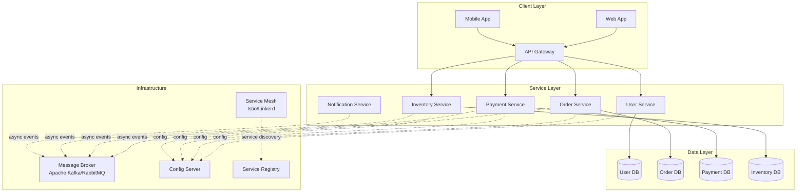
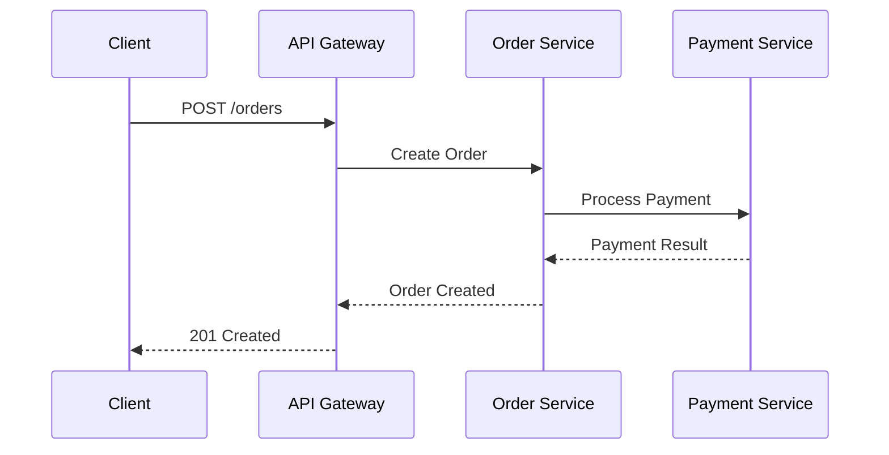
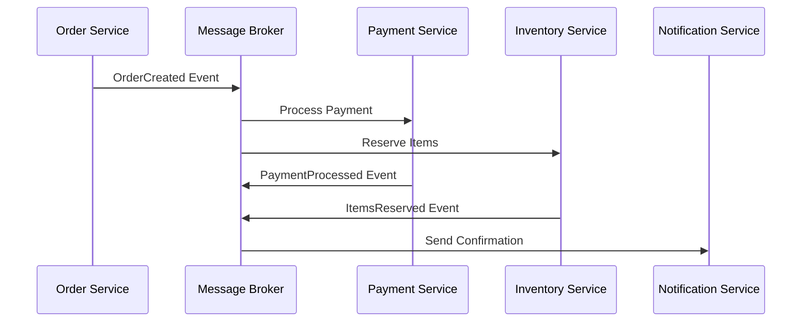
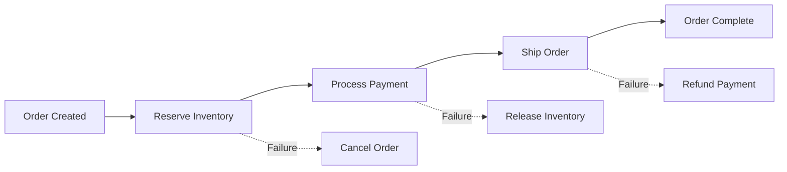

## Overview

Before we develop containerized applications, we must also understand the key architecture behind this. 

Microservices architecture is a modern approach to building applications as a suite of small, independently deployable services, each running in its own process and communicating via lightweight mechanisms such as HTTP APIs or messaging. This design enables teams to develop, deploy, and scale components independently, fostering agility and resilience.

## Microservices Architecture Diagram

### Bounded Contexts

A core concept in microservices is the **bounded context**—each service encapsulates a specific business capability and its own data model. This clear separation reduces coupling, minimizes dependencies, and allows teams to evolve services independently. Bounded contexts are often aligned with business domains, ensuring that each microservice has a well-defined responsibility and interface.

## Communication Patterns

### Synchronous Communication

**HTTP/REST APIs**
- Direct service-to-service communication
- Request-response pattern
- Suitable for real-time queries and commands
- Can introduce tight coupling and latency issues

**gRPC**
- High-performance, language-neutral RPC framework
- Protocol buffer serialization
- Supports streaming and bidirectional communication
- Better performance than REST for internal service communication

### Asynchronous Communication

**Event-Driven Architecture**
- Services communicate through events
- Loose coupling between services
- Better resilience and scalability
- Eventual consistency model

**Message Patterns**

1. **Publish-Subscribe (Pub/Sub)**
   - One-to-many communication
   - Publishers send events to topics
   - Multiple subscribers can consume events
   - Decoupled producers and consumers

2. **Message Queues**
   - Point-to-point communication
   - Guaranteed delivery and ordering
   - Load balancing across consumers
   - Suitable for work distribution

3. **Event Sourcing**
   - Store events as the source of truth
   - Rebuild state from event history
   - Audit trail and temporal queries
   - Complex but powerful pattern

**Async Communication Benefits**
- **Resilience**: Services can continue operating if others are down
- **Scalability**: Handle varying loads independently
- **Flexibility**: Easy to add new consumers without changing producers
- **Performance**: Non-blocking operations improve throughput

### Communication Anti-Patterns to Avoid

- **Chatty Interfaces**: Too many fine-grained service calls
- **Shared Databases**: Multiple services accessing the same database
- **Distributed Transactions**: Two-phase commits across services
- **Synchronous Chains**: Long chains of synchronous calls

### Transaction Management

Managing transactions in a distributed microservices environment is challenging. Traditional monolithic applications often rely on ACID transactions spanning multiple operations. In microservices, services typically own their data, making distributed transactions impractical. Instead, patterns such as **eventual consistency**, **sagas**, and **compensating transactions** are used:

- **Sagas**: Break a transaction into a series of local transactions, coordinated through events or commands. If a step fails, compensating actions are triggered to maintain consistency.
- **Eventual Consistency**: Accept that data may be temporarily inconsistent, but will become consistent over time as services synchronize via events.
- **Idempotency**: Ensure that repeated operations produce the same result, which is crucial for reliable message processing.

### Saga Pattern Example

### Best Practices for Microservices Communication

1. **Design for Failure**: Implement circuit breakers, retries, and timeouts
2. **Use Async When Possible**: Prefer event-driven communication for better resilience
3. **Implement Idempotency**: Ensure operations can be safely retried
4. **Monitor and Trace**: Use distributed tracing to understand request flows
5. **Version APIs**: Plan for backward compatibility and gradual rollouts
6. **Secure Communication**: Use mTLS, API keys, and OAuth for service authentication

### Further Reading

- [Red Hat Developer: Microservices Architecture](https://developers.redhat.com/topics/microservices)
- [Red Hat Developer: Bounded Contexts in Microservices](https://developers.redhat.com/articles/2021/09/15/bounded-contexts-microservices)
- [Red Hat Developer: Distributed Data Management Patterns](https://developers.redhat.com/articles/2021/09/15/distributed-data-management-microservices)
- [Martin Fowler: Microservices](https://martinfowler.com/articles/microservices.html)
- [Microservices.io: Patterns](https://microservices.io/patterns/index.html)
- [Event-Driven Architecture Patterns](https://microservices.io/patterns/data/event-driven-architecture.html)
- [Saga Pattern](https://microservices.io/patterns/data/saga.html)

By understanding bounded contexts, communication patterns, and distributed transaction management, you can design robust, scalable microservices that are well-suited for containerized and cloud-native environments.