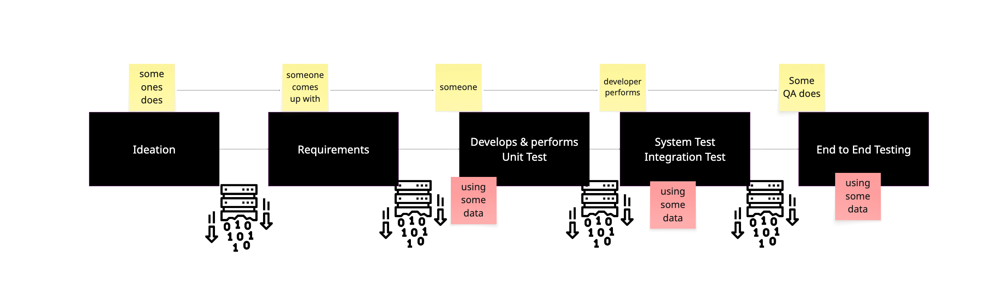
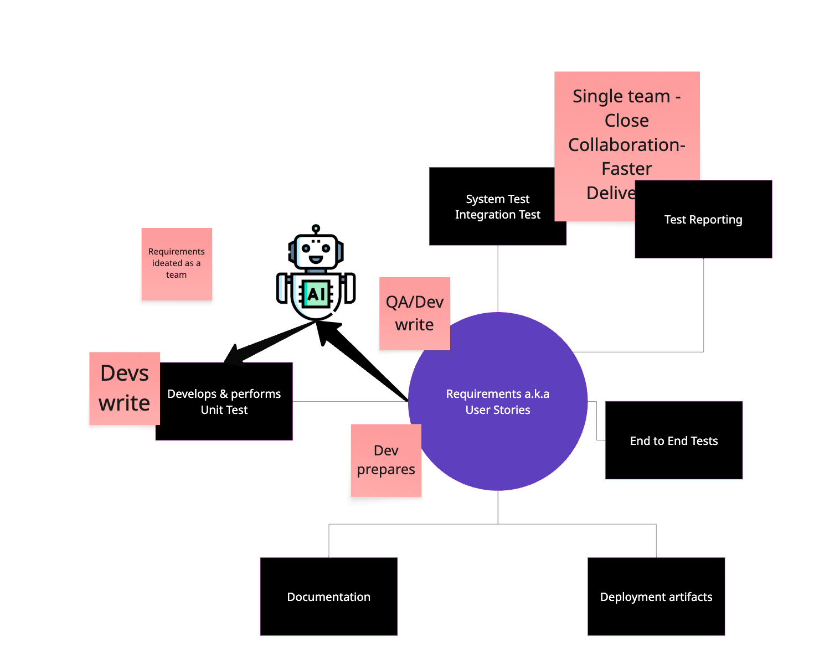

# Overview

A typical software development cycle often follows a linear, stage-gated process:

This traditional approach highlights two major challenges:

- **Requirements Drift:** There is a significant gap between the initial ideation/requirements phase and the final end-to-end testing. As the project progresses, the original requirements can become diluted or misinterpreted.
- **Information Loss:** With each handoff between stages (requirements, design, development, testing), some information or intent is lost or altered, increasing the risk that the delivered product does not fully align with the original vision.

How can we overcome these issues? This is where the **Requirement-Centric Development** approach comes into play.

---

## What is Requirement-Centric Development?

Requirement-Centric Development is a modern approach that places requirements at the heart of the entire software development lifecycle. Instead of treating requirements as a one-time, up-front activity, this approach ensures that requirements are continuously referenced, validated, and refined throughout all stages of development and testing.

In practice, teams implement this with BDD and TDD: BDD expresses requirements as executable Gherkin scenarios, and TDD drives code to satisfy them (see [BDD and TDD](./bdd_tdd.md)).

### Key Principles

- **Traceability:** Every feature, user story, test case, and piece of code is directly traceable back to a specific requirement.
- **Continuous Validation:** Requirements are validated early and often, not just at the end. This reduces the risk of late-stage surprises.
- **Collaboration:** Stakeholders, developers, testers, and product owners collaborate around requirements, ensuring shared understanding and alignment.
- **Living Documentation:** Requirements are treated as living artifacts that evolve with feedback and learning, rather than static documents.

### How It Works

The requirement-centric approach integrates requirements into every phase:

1. **Requirements Elicitation:** Gather and document clear, testable requirements with stakeholder input.
2. **Design & Development:** Design and implement features with direct reference to requirements, ensuring alignment.
3. **Automated Testing:** Derive test cases directly from requirements, enabling automated validation and regression testing.
4. **Continuous Feedback:** Use test results and stakeholder feedback to refine requirements and implementation iteratively.

---

## Requirement-Centric Development Lifecycle

The following diagram illustrates how requirements remain central throughout the process:

---

## Benefits

- **Reduced Risk of Misalignment:** By keeping requirements central, the risk of delivering the wrong product is minimized.
- **Faster Feedback Loops:** Early and continuous validation catches issues sooner.
- **Improved Quality:** Test cases derived from requirements ensure comprehensive coverage.
- **Greater Agility:** Requirements can evolve as new insights are gained, supporting adaptive planning.

